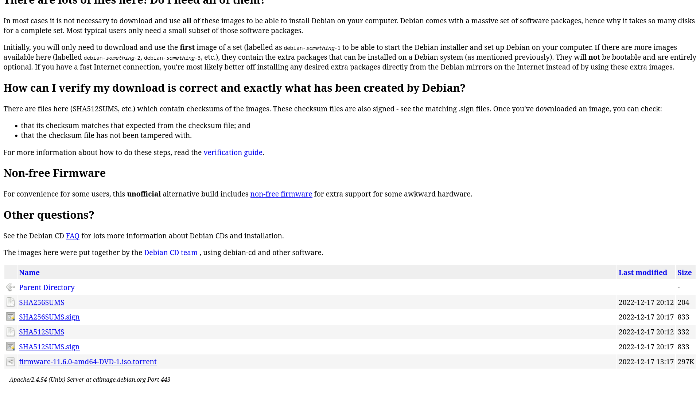

* Instalation guide for amd64

** Follow the link to download the latest release of Debian, with firmware packages included.
https://cdimage.debian.org/cdimage/unofficial/non-free/cd-including-firmware/
Latest stable version in iso-dvd is recommended.

